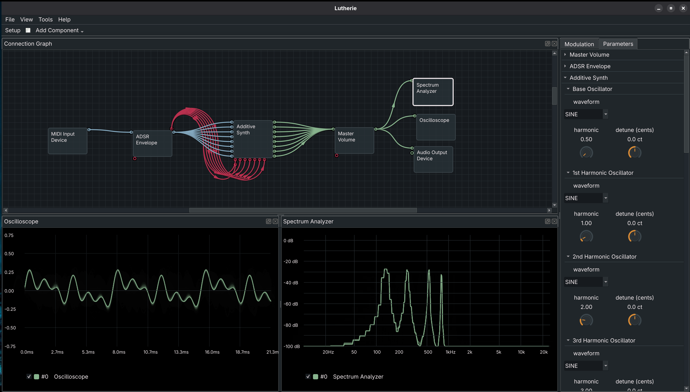

# Lutherie 

Lutherie is a fully modular synthesizer application. The inspiration behind this project was multifaceted:

In my experience with software synthesizers, you either get sleek interfaces with all the details abstracted away into a couple of macro knobs, where you aren't quite sure what they do but they sound sick right out the gate. Or you get a UI modeled after a popular synth from before I was born — complete with all the design decisions that were necessarily hamstrung by limited hardware real estate. I guess now there's a third group too, where someone AI-slops together some nonsense.

I'm not knocking either of the first two, but I find that I learn best by building something from the ground up, then abstracting away complexity as I learn. So I started building Lutherie: a standalone digital audio workshop designed around the unix philosophy of small, single-purpose components. Every building block, whether it's in the signal space or the buffered audio space, is the same kind of building block, able to interact with each other in unique ways.

The engine itself is capable of running headless, behind a documented JSON API over local sockets. The provided GUI is simply the default client for it. This allows for the backend engine to be fully controllable in low-level spaces. The GUI gets to be fully dedicated towards presenting all the complexity, while also giving users the ability to abstract it away. Component grouping, connection manipulations, parameter management, and modulation settings all allow for implementation details to be hidden or exposed to the user. Feedback in the form of analysis graphs is also available. This all gets saved into patches that allow any creation to be dropped back into the project. 

<figure>
  
  <figcaption><i>An 8-oscillator additive synth, each oscillator has a hidden gain control mapped to sliders on my hardware midi controller, with 4 harmonics currently silenced</i></figcaption>
</figure>

As Lutherie continues to mature, backend development will be focused on providing new components and functionality to the engine. Notably, frequency-domain processing (FFT/IFFT, spectral filtering, bin-level manipulation) as a first class citizen along with signal and buffer components will be a big focus. Conversely, frontend development will remain focused on exposing sensible visuals for each component, connection, and control, while looking for opportunities to provide user-defined abstractions to allow simplified presentations. Check out [TODO](TODO) for some questionably formatted development plans.

This is a learning project. I am not a trained DSP Engineer. I am just a guy whose curiosity and love of music has led him to spend less time as a musician and more time as an engineer. Feedback and suggestions are welcome and appreciated!

## License

This project is licensed under the GNU Lesser General Public License v3.0 - 
see the [LICENSE](LICENSE) file for details.

## Third-Party Libraries

This project uses:
- Qt6 (LGPL v3)
- KDDockWidgets (LGPL v3)
- RtMidi (MIT-style)
- RtAudio (MIT-style)
- KissFFT (BSD 3-Clause)
- spdlog (MIT-style)
- libsndfile (LGPL v2.1)
- libsamplerate (BSD 2-Clause)
 
See [THIRD_PARTY_LICENSES.txt](THIRD_PARTY_LICENSES.txt) for complete license information.

## Features

- **Fully Modular Architecture**: Create and connect individual synthesis modules (oscillators, envelopes, filters, etc.) in any configuration
- **Polyphonic Synthesis**: Built-in support for polyphonic oscillators and voice management, no bounds on polyphony.
- **Flexible Modulation System**: Every parameter can be modulated by any source through the ParameterMap design
- **Visual Patch Bay**: Draw connections between modules using an intuitive Qt6 interface
- **MIDI Support**: Connect and use any MIDI device for performance control via RtMidi
- **Audio**: Select your desired audio output device with RtAudio support
- **Extensible Design**: Clean separation between frontend and backend enables easy addition of new modules and potential development onto other platforms

## Current Status

**Platform Support**: Linux (currently)

The codebase uses cross-platform libraries (Qt6, RTAudio, RtMidi) and is designed to be extensible to other platforms, but usage is experimental and currently not well tested.

## Prerequisites

### Build Dependencies
- C++20 or later
- Qt6 development libraries
- KDDockWidgets 
- RtAudio
- RtMidi
- KissFFT
- spdlog
- libsndfile
- libsamplerate

### Runtime Requirements
- Linux operating system
- Audio system (ALSA, JACK, Pipewire)
- MIDI device (virtual keyboards are supported)

## Installation and Startup

```bash
## Requirements
- CMake 3.25+
- Ninja

## Quick install (from source)
cmake --workflow --preset install [-DCMAKE_INSTALL_PREFIX=/opt/]

## Build a release package
cmake --workflow --preset package
# Output: build/package/<package-name>

## Manual/advanced build
cmake --preset dev
cmake --build --preset dev

# execute (assuming install prefix is in path)
lutherie

# execute dev ()
./build/dev/synth/lutherie-backend # backend engine
./build/dev/gui/lutherie-gui # Qt6 front end
```

if the front end Qt6 environment is not desired, basic usage of the backend engine is available through `./debug/control-client.py`, which can be used in conjunction with a list of JSON api requests, some examples in that directory.

## Basic Usage

1. **Launch Application**: Start Lutherie
2. **Configure Hardware output/input**: Select your audio output device and midi input device through the setup menu.
3. **Create Components**: Add audio, modulation, midi, and/or buffer components
4. **Draw Connections**: Click and drag to connect module outputs to parameter inputs
5. **Edit Configuration**: Open up panels to adjust parameters and modulation controls. Right click parameters to adjust their limits or apply midi automations.
6. **Play**: Hit play to start the audio loop, and use your MIDI controller or computer keyboard to play your custom synthesizer!

## Project Structure

```
Lutherie/
├── docs/         # document library
├── debug/        # debug/testing python client with action scripts
├── gui/          # Qt6 frontend application
├── launcher/     # single executable
├── shared/       # shared definitions and configurations
├── synth/        # backend synthesis engine

```

## Acknowledgments

Built with:
- [Qt6](https://www.qt.io/) - Cross-platform GUI framework
- [RtAudio](https://github.com/thestk/rtaudio) - Cross-platform audio I/O
- [RtMidi](https://github.com/thestk/rtmidi) - Cross-platform MIDI I/O
- [KissFFT](https://github.com/mborgerding/kissfft) - Fast Fourier Transform Library
- [spdlog](https://github.com/gabime/spdlog) - logging
- [libsndfile](https://github.com/libsndfile/libsndfile) - read/write audio files
- [libsamplerate](https://github.com/libsndfile/libsamplerate) - resampling
  
---
